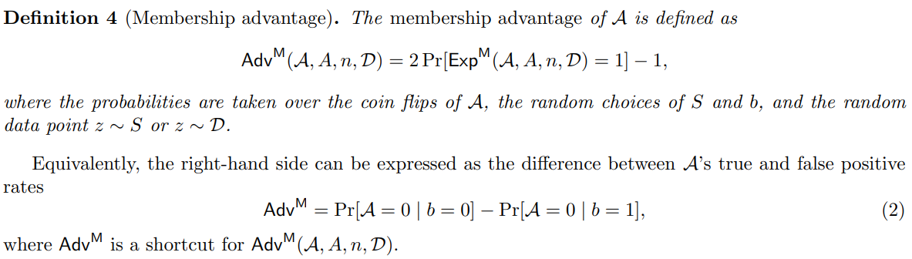

## Tensorflow Privacy - MIA Risk Scores

### 1. Adv - `Membership Advantage`

   > Calculates membership attacker's (or adversary's) advantage. 
    This metric is inspired by https://arxiv.org/abs/1709.01604, specifically
    by Definition 4. The difference here is that we calculate maximum advantage
    over all available classifier thresholds.
      
         max(np.abs(tpr - fpr))

   

### 2. PPV - `Positive Predictive Value of the membership attacker` 
   > Calculates Positive Predictive Value of the membership attacker.
    Defines the proportion of positive predictions that are true positives.
    It was suggested in https://arxiv.org/pdf/2005.10881.pdf
    that this would be a <b>suitable metric for membership attacks on datasets
    where the number of samples from the training set and the number of samples
    from the test set are very different.</b> These are referred to as imbalanced
    datasets.

         PPV=TP/(TP+FP)

### 3. LiRA with Gaussian
   > To minimize the number of shadow models, it is assumed `Q˜in/out` to be a Gaussian distribution, reducing the attack to estimating just four parameters: the mean and variance of each distribution.
   The critical difference between LiRA and other prior attacks is that they use a more efficient parametric approach, that models the distribution of losses as Gaussians.
   MIA is computed with scored loss values sampled over Gaussian ditribution.

      Calling API:
         scores = amia.compute_score_lira(stat_target, stat_in, stat_out, fix_variance=True)

### 4. LiRA with Offset
   > MIA is computed from loss score of each sample as `stat_target - some offset`, where `offset` is
    computed with stat_in, stat_out, or both depending on the option. The relation between the score and the membership depends on that between stat_target and membership.

      Calling API:
         scores = -amia.compute_score_offset(stat_target, stat_in, stat_out)

### 5. LiRA Baseline
   > Naively computes MIA from losses from the prediction of Target model for member and non-member data. 

